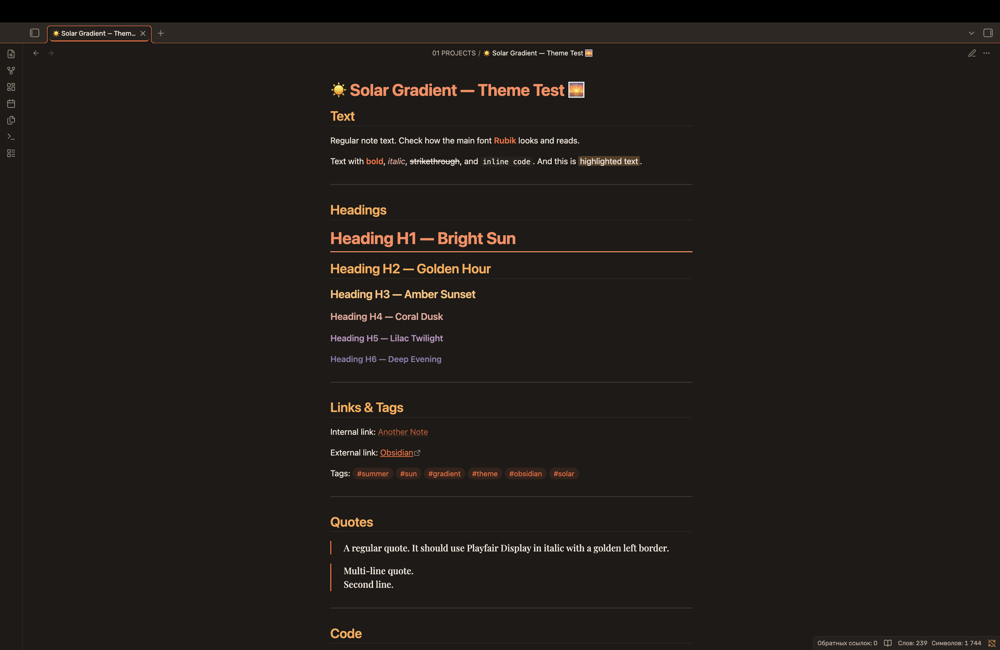
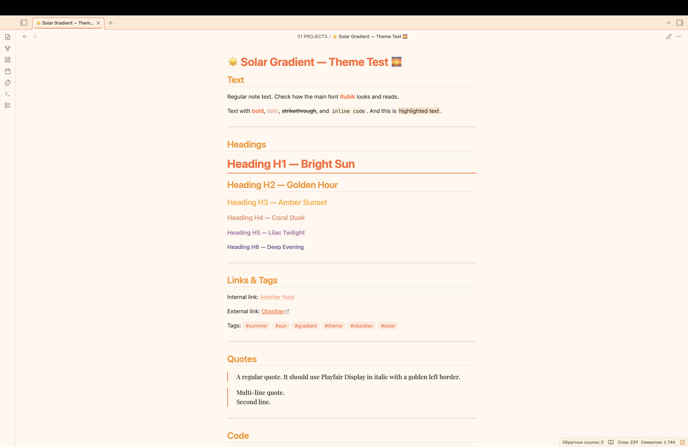

# ☀️ Solar Gradient - Obsidian Theme

An energetic summer theme for [Obsidian](https://obsidian.md) with a bright sunset gradient across headings and warm sandy tones. Made for sunny days, focused work, and vibrant note-taking.

---

## 📑 Table of Contents

- [✨ Features](#features)
- [📸 Screenshots](#screenshots)
- [📦 Installation](#installation)
- [🎨 Color Palette](#color-palette)
- [🛠️ Customization](#customization)
- [💡 Share Your Ideas](#ideas)
- [📝 Credits](#credits)

---

<a id="features"></a>

## ✨ Features

- ☀️ Energetic summer palette with bright orange and ocean blue accents
- 🌅 Sunset gradient across headings — from bright H1 to muted H6
- 🌓 Dark and light mode support
- 🏖️ Warm sandy background in light mode for comfortable reading
- 🔤 Bold typography: Rubik, Bebas Neue, Playfair Display, JetBrains Mono
- 🎯 WCAG-compliant contrast for accessibility
- ✨ Hardcoded accent colors that override user settings
- 🖊️ Smooth animations and transitions

---

<a id="screenshots"></a>

## 📸 Screenshots

### Dark Mode



### Light Mode



---

<a id="installation"></a>

## 📦 Installation

### From Obsidian Community Themes

1. Open Obsidian Settings
2. Go to **Appearance** → **Themes** → **Manage**
3. [Solar Gradient](https://community.obsidian.md/themes/solar-gradient)
4. Click **Install** and then **Use**

### Manual Installation

1. Download the `theme.css` and `manifest.json` files
2. Create a folder called `Solar Gradient` in your `.obsidian/themes/` directory
3. Place both files in this folder
4. Enable the theme in Obsidian Settings → Appearance → Themes

---

<a id="color-palette"></a>

## 🎨 Color Palette

### Heading Gradient

| Heading | Dark Theme | Light Theme | Mood           |
| ------- | ---------- | ----------- | -------------- |
| H1      | `#ff8a5c`  | `#ff6b35`   | Bright sun     |
| H2      | `#ffa94d`  | `#f7931e`   | Golden hour    |
| H3      | `#ffc078`  | `#ffb347`   | Amber sunset   |
| H4      | `#e8a598`  | `#e89b7c`   | Coral dusk     |
| H5      | `#b88fb8`  | `#b07aa8`   | Lilac twilight |
| H6      | `#8a7aa8`  | `#7a6a9a`   | Deep evening   |

### Base Colors

| Element    | Dark Theme | Light Theme |
| ---------- | ---------- | ----------- |
| Background | `#1e1a17`  | `#fff8f0`   |
| Text       | `#f5e8dc`  | `#3a2e28`   |
| Accent     | `#ff8a5c`  | `#ff6b35`   |
| Sea        | `#5aafc8`  | `#4a9eb8`   |

---

<a id="customization"></a>

## 🛠️ Customization

### Changing Colors

You can customize the theme by editing the CSS variables in `theme.css`:

```css
--solar-sun: #ff6b35; /* Change to your preferred bright orange */
--solar-gold: #f7931e; /* Change to your preferred golden */
--solar-sea: #4a9eb8; /* Change to your preferred ocean blue */
```

### Recommended Accent Color

For the best experience, set your Obsidian accent color to:

- **RGB:** `255, 107, 53`
- **HEX:** `#ff6b35`

> **Note:** The theme hardcodes accent colors, so user settings will be overridden.

---

<a id="ideas"></a>

## 💡 Share Your Ideas

Have an idea for a new feature or a bright detail you'd love to see in Solar Gradient? I'd love to hear it!

You can share your suggestions by:

- 🐛 Opening an [issue on GitHub](https://github.com/RamenOfficialGovPatsy/Solar-Gradient/issues)
- ✉️ Sending a message through the [Obsidian forum](https://forum.obsidian.md)

Your ideas help make this theme brighter for everyone! ☀️🌅

---

<a id="credits"></a>

## 📝 Credits

- Inspired by warm summer sunsets and bright sunny days
- Typography: Rubik, Bebas Neue, Playfair Display, JetBrains Mono
- Designed for energy, focus, and aesthetics

---

**Enjoy the bright Solar Gradient vibes! ☀️🌅**
